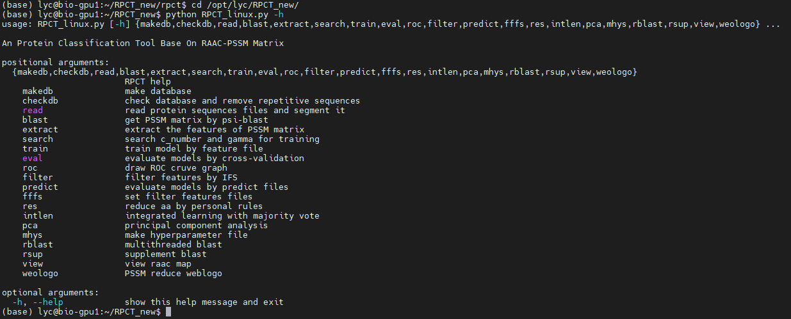

# Introduction

## Abstract

The RPCT toolkit is a dedicated toolkit based on the **RAAC-PSSM** protein classification prediction method, which developed by [**Zuo's Lab**](about.md). It uses 7 feature extraction methods and **SVM** ([Support Vector Machines](default.md)) for protein classification prediction. You can find almost all common functions which used in protein classification in the RCT toolkit, and get better classification models and more diverse results analysis.

## 1. RPCT Model Structure

RPCT uses 7 feature extraction methods to extract effective features 
(
[**raaPSSM**](method.md), 
[**OAAC**](method.md), 
[**SAAC**](method.md), 
[**raaKmer**](method.md), 
[**raaKPSSM**](method.md), 
[**raaSW**](method.md), 
[**raaDTPSSM**](method.md)
) 
from amino acid sequences, selects key features through three feature selection methods 
(
[**F-score**](method.md), 
[**Relief**](method.md), 
[**PCA**](method.md)
) 
and trains classification models through SVM(Fig1.1).

**Fig1.1.** RPCT Classification Process

## 2. Advantages Of RPCT Model

### Why we choose machine learning?

**Traditional protein analysis methods** are mostly physical and chemical methods. Such as X-ray crystal diffraction and nuclear magnetic resonance technology. It not only **waste a lot of time**, but also **consumes a lot of manpower and material resources**. Mining the features in the protein sequence and predicting protein through **machine learning** can not only **greatly improve the prediction efficiency**, but also **obtain higher-accuracy results** compare with experimental analysis.

### What is the RAAC?

The concept of **Reduced Amino Acids** was proposed in 1960. It has great potential in sequence alignment and structure prediction(Fig1.2). In **Zuo**'s article, the [**PseKRAAC method**](http://bioinfor.imu.edu.cn/public/index.html) has been proposed and a [**web server**](http://bigdata.imu.edu.cn/) based on PseKRAAC has been built. In **Zheng**'s [**web server**](http://bioinfor.imu.edu.cn/raacbook/public/), 74 types of **Reduce Amino Acid Codes** and literature sources have been listed in detail.

**Fig1.2.** One of the RAAC Maps from Zheng's Web server

### What are the advantages of RAAC?

As the complexity of prediction models and the diversity of feature extraction continue to increase, **the cost of protein prediction based on machine learning is also increasing quickly**. Amino acid reduction can not only **simplify the protein sequence**, make the sequence more concise and clear, but also **reduce the dimension of the feature space** and **reduce the input cost** of machine learning. Moreover, through different reduction schemes, we can **get more accurate prediction results and richer biological significance**(Fig1.3).

**Fig1.3.** Two methods of feature selection (Left: IFS-RF; Right: IFS-PCASVD)

**Fig1.4.** The classification weight of different Amino Acids

**Fig1.5.** The classification weight of different Amino Acids pairs

**Fig1.6.** Distribution of the first 200 dimensional features

**Fig1.7.** Sequence Reduce Weblogo

### How many platforms does the RPCT toolkit support?

We have built a convenient program on **Windows** and **Linux platforms** respectively. Users can run the Windows version of the program in CMD to open the GUI, set parameters and submit tasks through the interactive window.

**Fig1.8.** RPCT toolkit GUI

Users can also run Linux version programs in CMD to submit tasks and parameters directly through Linux commands.

**Fig1.9.** RPCT toolkit CMD

In addition, we developed [**pyrpct**](https://github.com/KingoftheNight/RPCT/) (a python package based on RPCT method) for those who need further development, and we described the API of all functions in detail. Users can not only download and install it from [GitHub](https://github.com/), but also use the **pip command** to call pyrpct easily.

    pip install git@github.com:KingoftheNight/RPCT.git -U

## Tips

You should read the following process to learn how to use the RPCT toolkit:

* [Preparation before installation](preparation.md)

* [RPCT toolkit Installation](installation.md)

* [Follow the sample](sample.md)

* [Read the function Manual](function.md)