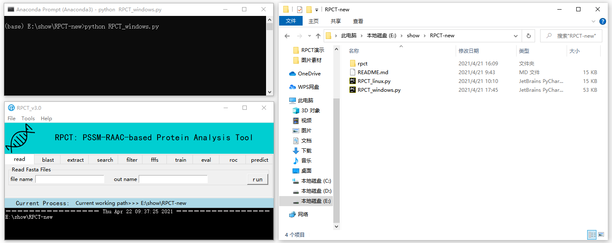

# Installation

In this page, we will show you how to install the RPCT toolkit on different platforms. Before starting the installation, you need to confirm that the preparations have been completed. If you haven't finished the preparation, you'd better finish it first ([turn to Preparation](preparation.md)).

## Linux

You can download RPCT toolkit by wget command (Fig1.1-1.4).

**Fig1.1.** Open Linux command line (We used the MobaXterm program based on Linux)

    wget https://github.com/KingoftheNight/RPCT/archive/refs/heads/main.zip

If you are warned that cannot verify github.com's certificate, you can add '--no-check-certificate' after URL.

    wget https://github.com/KingoftheNight/RPCT/archive/refs/heads/main.zip --no-check-certificate

**Fig1.3.** Dowmload RPCT-main.zip without check-certificate

After downloading, you will find main.zip has appeared in the current directory. You should use unzip command to release it.

    unzip main.zip

**Fig1.4.** Release main.zip

Then, you can check it through ls command.

    cd RPCT-main
    ls

**Fig1.5.** Check RPCT toolkit

After you complete the above steps, you can open the RPCT toolkit. You need to make sure that the RPCT toolkit program is available in the current directory. Or you can jump to the corresponding directory by cd command.

    python RPCT_linux.py -h

**Fig1.6.** Check the RPCT toolkit

## Windows

You can download ***RPCT-main.zip*** from [GitHub](https://github.com/KingoftheNight/RPCT) (Fig1.1-1.4).

**Fig1.1.** Turn to RPCT project on GitHub

**Fig1.2.** Click Code button and choose Download-ZIP

**Fig1.3.** Find RPCT-main.zip and copy it to a new folder

**Fig1.4.** Unzip and check if the package file is complete

After you complete the above steps, you can open the RPCT toolkit in CMD or Anaconda Prompt. You need to make sure that the RPCT toolkit program is available in the current directory. Or you can jump to the corresponding directory by cd command.

    python RPCT_windows.py

**Fig1.5.** Check the GUI of RPCT toolkit

## pyrpct

