# Method

In this page, we specifically describe the methods used by the RPCT toolkit. If you want to understand these methods or improve your method on this basis, you can read this page carefully.

## RAAC-PSSM feature extraction method

In RPCT toolkit, we used seven methods to extract **sequence feature**. We connect the 7 types of features we get, and get the final feature file through the normalization function (Fig1.1).

**Fig1.1.** Normalization Function

### 1. raaPSSM

In this study, we use the local version of [**BLAST+**](default.md) to extract the PSSM matrix, choose the PDB database (pdbaa) as the comparison database. The expected value is set to 0.001, and the number of iterations is set to 3. The obtained PSSM matrix is an Lx40-dimensional matrix containing the header (Fig1.2). 

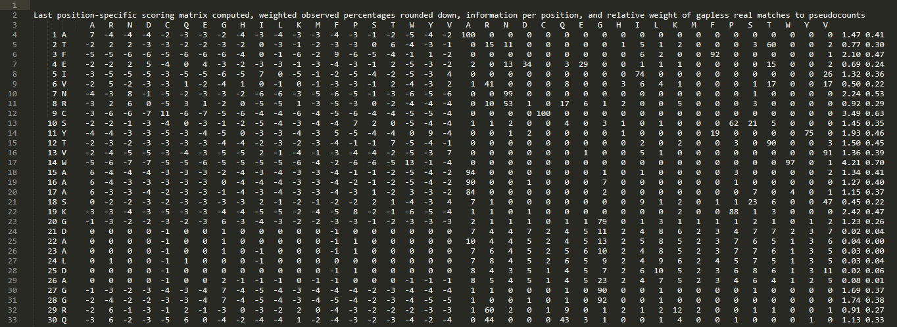

**Fig1.2.** PSSM matrix

We remove the header, extract the first 20 columns as the standard PSSM matrix S, and extract the amino acid sequence information at the same time. After that, we add the rows of the same amino acid residues to obtain a 20x20-dimensional matrix S°. After that, we use 671 types of RAAC to reduce the matrices to obtain 671 types of size x size dimension reduction matrices, and transform them into a single-row raaPSSM reduced feature matrix (Fig1.3).

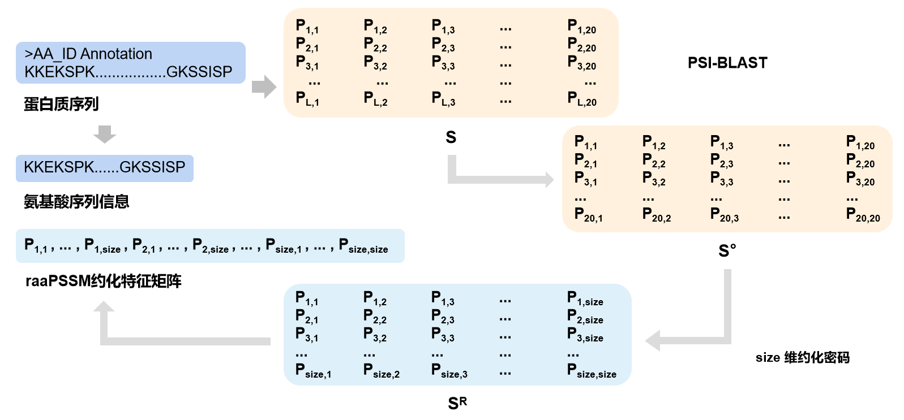

**Fig1.3.** raaPSSM method

### 2. OAAC

Overall amino acid composition (OAAC) is a common sequence feature extraction method, which is widely used in various protein prediction studies. We extract the amino acid frequency of each sequence into a 20 dimension feature matrix (Fig1.4).

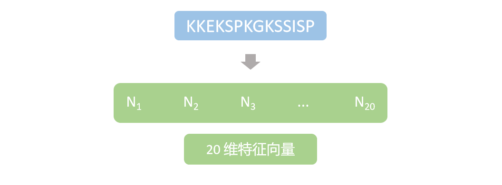

**Fig1.4.** OAAC method

### 3. SAAC

In Zou’s article, a sequence feature extraction method based on split amino acid components was used, which named Split Amino Acid Composition (SAAC). For sequences with different lengths, we use different segmentation methods to extract features. According to zou's article, we set N to 25 and c to 10. For each of three parts, we use the OAAC method to extract 20 amino acid frequencies, and output them as a 60-dimensional feature matrix (Fig1.5).

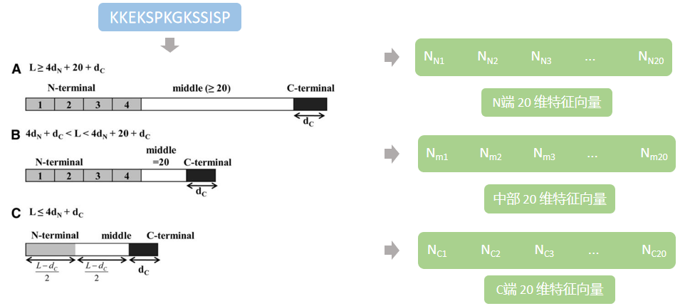

**Fig1.5.** SAAC

### 4. raaKmer

Kmer can extract the peptide composition information and partial sequence information of the sequence by setting the k value. In RPCT, we set k to 2. We first simplify the sequence through 671 types of RAAC, and constructed a size x size dipeptide ID box. Then we extracted the dipeptide component through a sliding window and counted the frequency (Fig1.6).

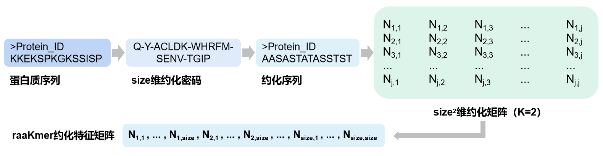

**Fig1.6.** raaKmer

### 5. raaKPSSM

Xu's article proposed a PSSM matrix feature extraction method based on K partition, which contains two parts features, PSSM-SDT, PSSM-DDT. For PSSM-SDT, they add up the scores of the same residues separated by k rows and average them to obtain a 20-dimensional feature matrix. For PSSM-DDT, they add up the scores of different residues at intervals of k rows and average them to obtain a 400-dimensional feature matrix. But in our method, we use the reduced PSSM matrix instead of the original PSSM matrix, and output size x size dimensions feature matrix (Fig1.7).

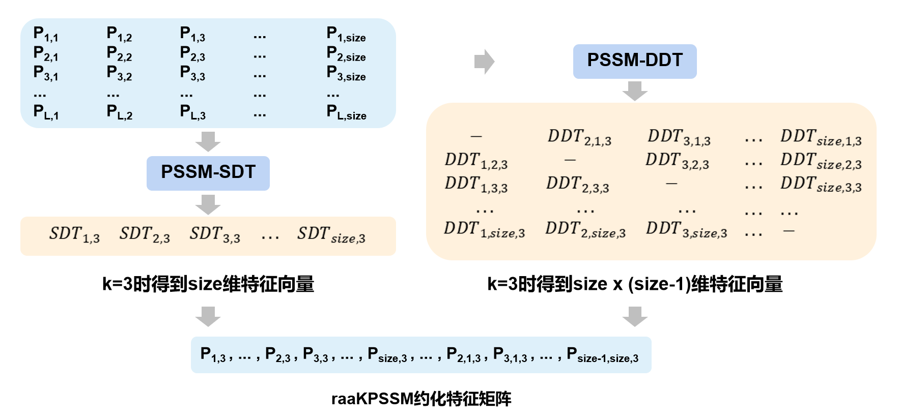

**Fig1.7.** raaKPSSM

### 6. raaSW

Sliding window (SW) is a common feature extraction method, which can effectively extract the local information of a sequence or matrix. In our method, we use the raaPSSM method to extract the sliding window matrix and obtain size x size dimension feature matrix (Fig1.8).

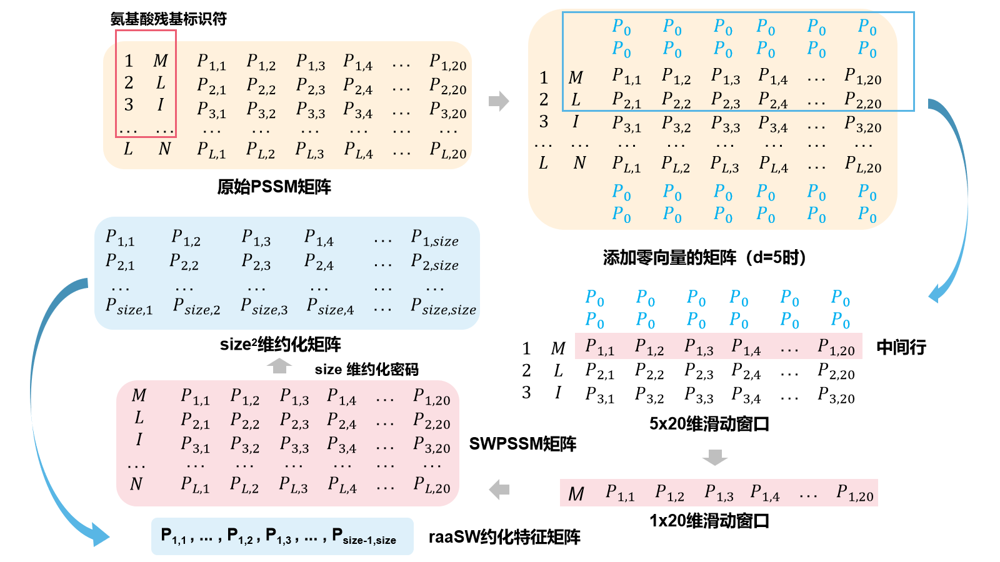

**Fig1.8.** raaSW

### 7. raaDTPSSM

In liu's article, a Distance-based Top-n-gram (DT-PSSM) feature extraction method is proposed. Firstly, they extract the amino acid residues represented by the maximum value in each row to construct a new consensus sequence. Then, they carried out OAAC feature extraction and dipeptide feature extraction based on d interval respectively on the consensus sequence. Finally, they can get 1220-dimensional feature matrix. In our method, we use the reduced PSSM matrix instead of the original PSSM matrix, and output 3 x size x size + size dimensions feature matrix (Fig1.9).

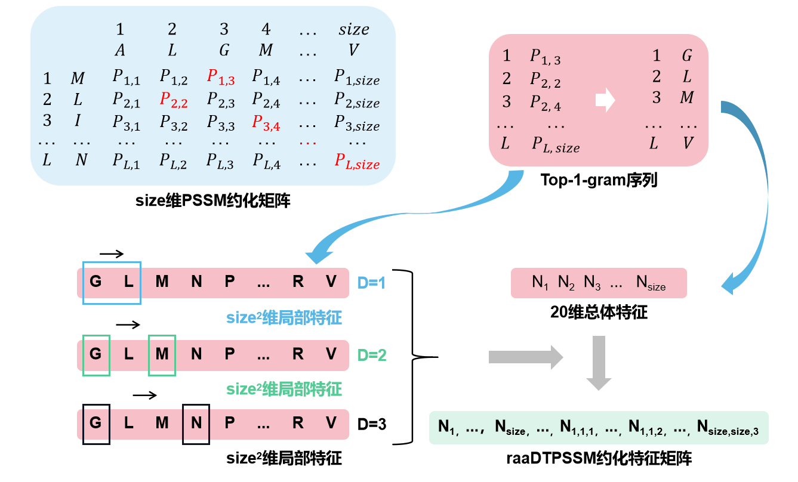

**Fig1.9.** raaDTPSSM

## Feature Selection Methods

### 1. IFS-RF

We propose a feature extraction method called IFS-RF, which uses Relief and F-score methods to comprehensively evaluate the classification weight of each feature, and perform feature ranking through Incremental Feature Screening (IFS).

The Relief method calculates feature classification weights through multiple sampling iterations, and has better feature screening performance in binary classification data (Fig2.1).

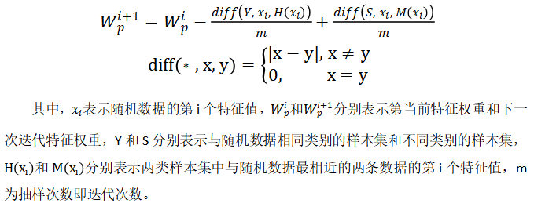

**Fig2.1.** Relief

The F-score method is a fast and stable feature screening method, which has been used in many studies (Fig2.2).

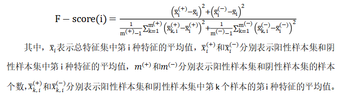

**Fig2.2.** F-score

After getting the two weight scores, we use the following formula to get the final weight of the feature (Fig2.3).

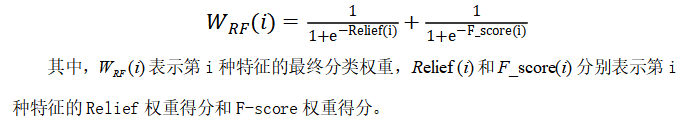

**Fig2.3.** IFS-RF

### 2. IFS-PCASVD

Principal Component Analysis (PCA) is a commonly used research method in bio-informatics research and has a good dimensionality reduction effect. However, the traditional PCA method based on the autocovariance matrix obtains a brand new feature matrix, in which the feature value is not related to the original feature value, so it cannot produce meaningful feature screening results. PCA based on Singular Value Decomposition (SVD) uses another method to calculate dimensionality reduction features to obtain the same dimensionality reduction result, and the weight of each feature can be obtained. Therefore, we construct a dimensionality reduction feature matrix according to the feature weights given by PCASVD, and use the IFS-PCASVD method to construct a dimensionality reduction feature matrix.

## Cite

*Zou C, Gong J, Li H. An improved sequence based prediction protocol for DNA-binding proteins using SVM and comprehensive feature analysis[J]. BMC Bioinformatics, 2013, 14: 90.*

*Xu R, Zhou J, Wang H, et al. Identifying DNA-binding proteins by combining support vector machine and PSSM distance transformation[J]. BMC Syst Biol, 2015, 9 Suppl 1(Suppl 1): S10.*

*Liu B, Wang X, Lin L, et al. A discriminative method for protein remote homology detection and fold recognition combining Top-n-grams and latent semantic analysis[J]. BMC Bioinformatics, 2008, 9: 510.*