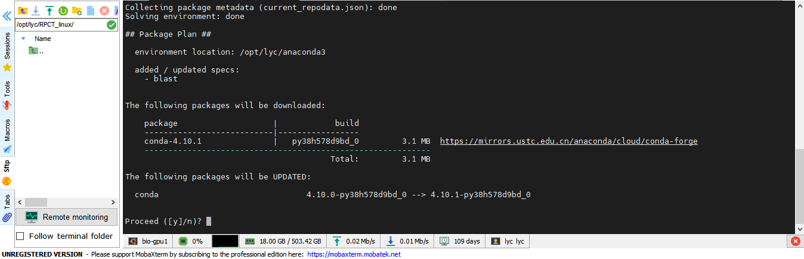

# Preparation

In this page, we will help you complete the preparation work before installation. You should choose one of the following platforms to configure.

## Linux

### 1.1 Install Anaconda

You can install Anaconda from[ *https://www.anaconda.com/* ](https://www.anaconda.com/)and choose Linux platform to download. If you have any questions, please refer to [CONDA](https://conda.io/projects/conda/en/latest/user-guide/install/linux.html).

**Fig1.1.1.** Log in to the Anaconda, select Individual Edition from the products

**Fig1.1.2.** Choose 64-Bit (x86) Installer of Linux (Suggest)

**Fig1.1.3.** Copy Anaconda Installer to your Linux system

If you want to download it on Linux platform, you can use wget command to get it, either. 

    wget https://repo.anaconda.com/archive/Anaconda3-2020.11-Linux-x86_64.sh

If you are warned that cannot verify github.com's certificate, you can add '--no-check-certificate' after URL.

    wget https://repo.anaconda.com/archive/Anaconda3-2020.11-Linux-x86_64.sh --no-check-certificate

**Fig1.1.4.** Download Anaconda from Linux (We used the MobaXterm program based on Linux)

Then you can install Anaconda by following command. Follow the prompts to install and keep the default if you are unsure how to choose.

    bash Anaconda3-2020.11-Linux-x86_64.sh

**Fig1.1.5.** Install Anaconda

You can try conda commands to make sure it has been installed.

    conda

**Fig1.1.6.** Input conda commands

### 1.2 Install Blast+

You can install BLAST+ from[ *https://ftp.ncbi.nlm.nih.gov/blast/executables/blast+/LATEST/* ](https://ftp.ncbi.nlm.nih.gov/blast/executables/blast+/LATEST/)and choose Linux platform to download. Or you can install it on Linux system through conda command.

**Fig1.2.1.** Log in to the BLAST+, select ncbi-blast-2.11.0+-x64-linux.tar.gz

**Fig1.2.2.** Copy ncbi-blast-2.11.0+-x64-linux.tar.gz to your Linux system

    conda install -c bioconda blast

**Fig1.2.3.** Install BLAST+ through conda command

Then you can try run blast program to make sure it has been installed successfully.

    blastn -h

**Fig1.2.4.** Check BLAST+

## Windows

### 2.1 Install Anaconda

You can install Anaconda from[ *https://www.anaconda.com/* ](https://www.anaconda.com/)and choose Windows platform to download. If you have any questions, please refer to [CONDA](https://docs.conda.io/projects/conda/en/latest/user-guide/install/windows.html) (Fig1.1-1.4).

**Fig1.1.** Log in to the Anaconda, select Individual Edition from the products

**Fig1.2.** Choose 64-Bit Graphical Installer of Windows (Suggest)

**Fig1.3.** Copy Anaconda Installer to a new folder and click it to start installation

**Fig1.4.** Follow the prompts to install and keep the default if you are unsure how to choose

After installation, you can check Anaconda from Start Menu (Fig1.5).

**Fig1.5.** Check Anaconda

You can open CMD by Win+R to try conda commands if you have add Anaconda to your path environment. Or you can open Anaconda Prompt from Start Menu to try conda commands (Fig1.6-1.7).

**Fig1.6.** Input conda commands by CMD

**Fig1.7.** Input conda commands by Anaconda Prompt

## Support packages

Whether on the windows platform or on the linux platform, RPCT relies on many python packages, most of them are common packages that come with python, but you still need to manually install some uncommon packages. And we suggest you install them through conda command instead of pip command, because conda can help you to configure dependent environments better. Here are some important packages you must install, and if you are warned that you don't have some packages, you can also install them through conda command.
    
    # conda install [package name]
    
    conda install sklearn   
    conda install ray    
    conda install pyecharts
