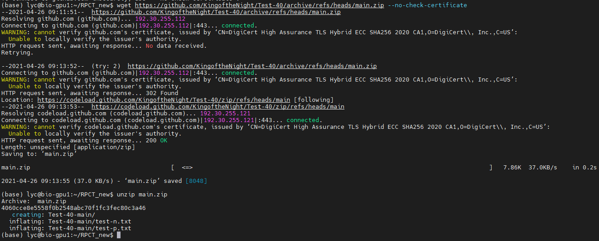
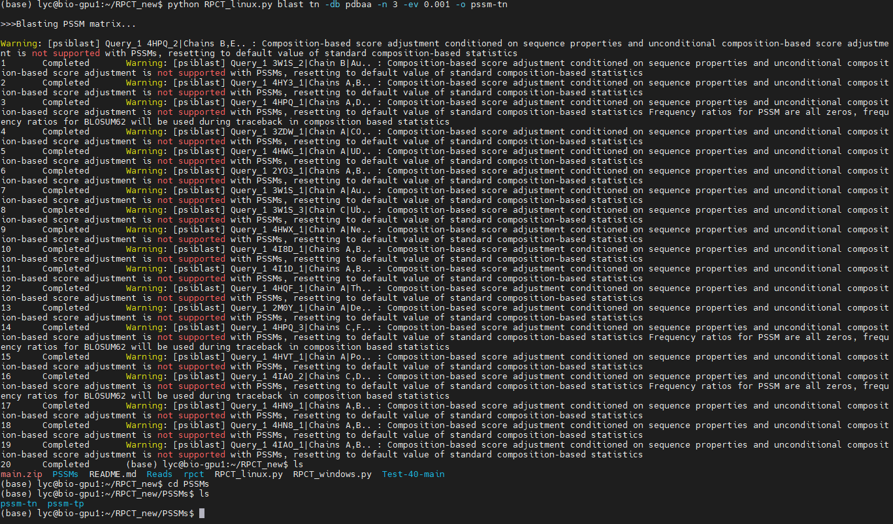
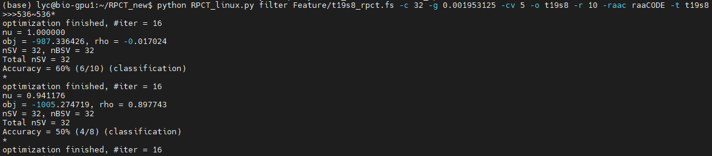
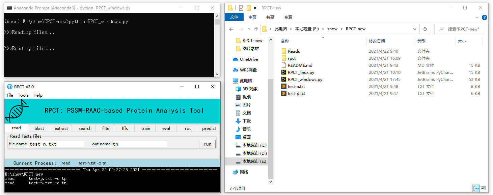
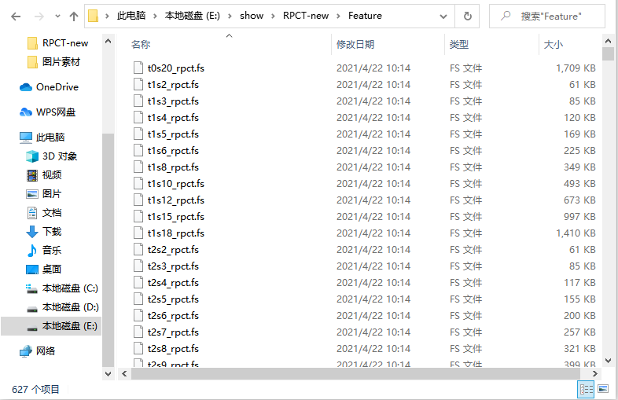
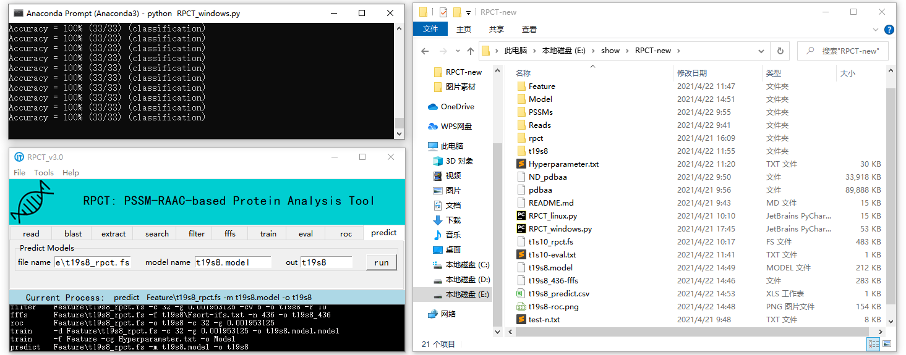
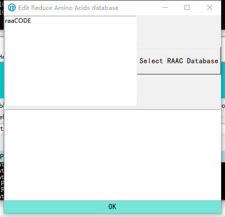
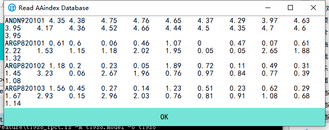

# Sample

In this page, we will give a complete analysis process guidance, and demonstrate the use of the RPCT toolkit through a little sample dataset.

## Linux

### 1. View RPCT-GUI and Structure

RPCT toolkit consists of two startup programs, an instruction file and a program folder. 

    $ ls

**Fig1.1.** RPCT toolkit

The rpct folder is the core folder of RPCT toolkit, and you'd better not change it arbitrarily to avoid program bugs. All programs and database were saved in rpct folder. 

    $ cd rpct
    $ ls

**Fig1.2.** rpct folder

***/aaindexDB*** : *contains the latest AAindex database information*;
***/bin*** : *contains windows icons, software history, etc*;
***/blastDB*** : *contains blast databases (before you build the database, it contains nothing)*;
***/libsvm-3.24*** : *contains the core programs of libsvm-3.24*;
***/raacDB*** : *contains the book of reduce amino acid codes (raaCODE : contains 627 different raacs)*.

**Fig1.3.** RPCT toolkit Structure

You can search RPCT function through following command.

    $ cd ../
    $ python RPCT_linux.py -h

**Fig1.4.** Search RPCT functions

Or you can view Precautions for all commands and their parameters through following command (Press Q to return).

    $ less README.md

**Fig1.5.** View Precautions

### 2. Start a new project

#### Datasets

You can download the test datasets on [GitHub](https://github.com/KingoftheNight/Test-40/archive/refs/heads/main.zip) or by following commands. We provide a pair of small protein datasets which contain 20 DNA-binding proteins and 20 non-binding proteins. You should save them in RPCT main program directory.

    $ wget https://github.com/KingoftheNight/Test-40/archive/refs/heads/main.zip --no-check-certificate
    $ unzip main.zip
    $ ls

**Fig1.6.** Download test datasets

#### Read

Choose read function, input the dataset name and out folder name as follow. Then you will get a Reads folder contains your fasta folder.

    $ python RPCT_linux.py read Test-40-main/test-p.txt -o tp
    $ ls
    $ cd Reads
    $ ls
    $ cd tp
    $ ls

**Fig1.7.** Read test-p.txt

In the same way, read test-n.txt and output tn subfolder.

    $ python RPCT_linux.py read Test-40-main/test-p.txt -o tp
    $ ls
    $ cd Reads
    $ ls

**Fig1.8.** Read test-n.txt

#### Blast

Choose blast function, input the fasta folder name, blast database, number, evaluate and out folder name as follow (You need to confirm that your database exists, and if you haven’t added any database yet, you need to view Additional functions-Check Blast Database). Then you will get a PSSMs folder contains your pssm folder. The blast result is affected by the blast database, and sometimes it may not be possible to get the target PSSM-profile.

    $ python RPCT_linux.py blast tp -db pdbaa -n 3 -ev 0.001 -o pssm-tp

**Fig1.9.** Blast

**Fig1.10.** /PSSMs/pssm-tp

In the same way, blast tn and output pssm-tn subfolder.

    $ python RPCT_linux.py blast tn -db pdbaa -n 3 -ev 0.001 -o pssm-tn

**Fig1.11.** Blast completed

#### Extract

Choose extract function, input the pssm folder name, lmda, raaCODE and out folder name as follow (**Folder mode**). Then you will get a Feature folder contains feature files with different RAACs.

    $ python RPCT_linux.py extract pssm-tp pssm-tn -raa raaCODE -o Feature -l 5
    $ cd Feature
    $ ls

**Fig1.12.** Extract (Folder mode)

**Fig1.13.** /Feature

And you can also input the pssm folder name, lmda and selfraac as follow (**Document mode**). Then you will get a feature file with your RAAC. The name of feature file default to **t1sn_rpct.fs** (n is the size of your RAAC).

    $ python RPCT_linux.py extract pssm-tp pssm-tn -l 5 -r AGST-RK-ND-C-QE-H-ILMV-FY-P-W

**Fig1.14.** Extract (Document mode)

#### Search

Choose search function, input the folder name as follow (**Folder mode**). Then you will get a Hyperparameters file. That might take some time, but you can get all Hyperparameters of your target feature files folder.

    $ python RPCT_linux.py search -f Feature

**Fig1.15.** Search (Folder mode)

If you want to search only one file, you can also input the feature file nameas follow (**Document mode**). Then you will get the C_number and Gamma.

    $ python RPCT_linux.py search -d t1s10_rpct.fs

**Fig1.16.** Search (Document mode)

#### Evaluate

Choose eval function, input the folder name, cross-validation fold, out folder name and cg file name as follow (**Folder mode**). Then you will get a evaluate-result folder.

    $ python RPCT_linux.py eval -f Feature -cg Hyperparameters.txt -cv 5 -o Eval_fs

**Fig1.17.** Evaluate (Folder mode)

    $ ls
    $ cd Eval_fs
    $ ls

**Fig1.18.** /Eval_fs

And you can also input the single feature file name, C_number, Gamma, cross-validation fold and out file name as follow (**Document mode**). Then you will get a evaluate result file with your target feature model.

    $ python RPCT_linux.py eval -d t1s10_rpct.fs -c 0.03125 -g 0.0078125 -cv 5 -o t1s10

**Fig1.19.** Evaluate (Document mode)

    $ less t1s10-eval.txt
    $ q

**Fig1.20.** t1s10-eval.txt

#### Filter

Choose filter function, input the feature file name, C_number, Gamma, cross-validation fold, random sampling times, out file name, RAAC book name and reduce  ass follow. Then you will get a filter-result folder.

    $ python RPCT_linux.py filter Feature/t19s8_rpct.fs -c 32 -g 0.001953125 -cv 5 -o t19s8 -r 10 -raac raaCODE -t t19s8

**Fig1.21.** Filter

**Fig1.22.** /t19s8

#### Filter-feature-file set

Choose fffs function, input the feature file name, IFS file name, end feature number and out file name as follow. Then you will get a filter-feature-file.

    $ python RPCT_linux.py fffs Feature/t19s8_rpct.fs -f t19s8/Fsort-ifs.txt -n 436 -o t19s8_436
    $ ls

**Fig1.23.** FFFs

#### ROC

Choose roc function, input the feature file name, out file name, C_number and Gamma as follow. Then you will get a roc curve graph.

    $ python RPCT_linux.py roc Feature/t19s8_rpct.fs -c 32 -g 0.001953125 -o t19s8

**Fig1.24.** ROC

#### Train

Choose train function, input the folder name, out folder name and cg file name as follow (**Folder mode**). Then you will get a model folder.

    $ python RPCT_linux.py train -f Feature -cg Hyperparameters.txt -o Model

**Fig1.25.** Train (Folder mode)

You can also input the feature file name, C_number, Gamma and out file name as follow (**Document mode**). Then you will get a feature model.

    $ python RPCT_linux.py train -d Feature/t19s8_rpct.fs -c 32 -g 0.001953125 -o t19s8.model

**Fig1.26.** Train (Document mode)

#### Predict

Choose predict function, input the feature file name, model name and out file name as follow. Then you will get a predict-result file and Accuracy of prediction on CMD.

    $ python RPCT_linux.py predict Feature/t19s8_rpct.fs -m t19s8.model -o t19s8

**Fig1.27.** Predict

### 3. Additional functions

#### Check Blast Database

For a new RAAC toolkit, we don't provide any blast database (Considering the inconvenience of downloading). Therefore you should download public database from [BLAST](https://ftp.ncbi.nlm.nih.gov/blast/db/) or create your own blast database. We provide two functions to help you, **Check Blast Database** and **Make Blast Database**. If you download the formatted database, you can pass these two steps. If you download the initial database (FASTA format), you should check your database before you make it.

    $ wget https://ftp.ncbi.nlm.nih.gov/blast/db/FASTA/pdbaa.gz --no-check-certificate
    $ ls
    $ gunzip pdbaa.gz
    $ ls

**Fig1.28.** Download blast database

    $ python RPCT_linux.py checkdb pdbaa
    $ ls

**Fig1.29.** Check Blast Database

#### Make Blast Database

You can make your own blast database by this function. And you should check it before you make.

    $ python RPCT_linux.py makedb ND_pdbaa -o pdbaa

**Fig1.30.** Make Blast Database

**Fig1.31.** /rpct/blastDB

#### Set Hyperparameters File

You can set the Hyperparameters file according to your experience (Considering that not all grid hyperparameters can get the best prediction model, and it takes too long time to grid the hyperparameters in folder mode).

    $ python RPCT_linux.py mhys Feature -c 8 -g 0.125 -o Hys_1.txt
    $ ls

**Fig1.32.** Set Hyperparameters File

#### Integrated Learning

You can use the integrated learning function to make simple protein ensemble predictions. You need input the train features folder, predict features folder, evaluate file, hyperparameters file and model members. And the program will choose the best n feature models to join in the majority vote. If more than half of the members predict that it is a binding protein, it is finally predicted to be a binding protein. In this sample, we use the same features folder to show this function, and you should set the features folder of predict-datasets as same as train-datasets.

    $ python RPCT_linux.py intlen -tf Feature -pf Feature -ef Eval_fs/Features_eval.csv -cg Hyperparameter.txt -m 5
    $ ls

**Fig1.33.** Integrated Learning

#### Principal Component Analysis

You can obtain feature filder results through the principal component analysis function. We use it as a backup option for IFS-RF. It can usually get a lower feature dimension, but the heighest prediction accuracy is slightly lower than IFS-RF.

    $ python RPCT_linux.py pca Feature/t19s8_rpct.fs -c 32 -g 0.001953125 -cv 5 -o t19s8
    $ ls
    $ cd t19s8
    $ ls

**Fig1.34.** Principal Component Analysis

**Fig1.35.** /t19s8

#### Self Reduce Amino Acids Code

You can generate custom reduced amino acid codes through the self reduce amino acids code function. You need input an AAindex ID as follow (If you don't know how to get ID, please view the Additional functions-AAindex). The program will search AAindex database, which was saved in aaindexDB folder in rpct folder, to calculate the Euclidean distance of amino acid residues and out put the RAACs of your rules.

    $ python RPCT_linux.py res ARGP820103

**Fig1.36.** Self Reduce Amino Acids Code

#### View RAAC Map Of Different Type

You can view the reduced maps of raac in different types through the view RAAC map of different type function.

    $ python RPCT_linux.py view raaCODE -t 19

**Fig1.37.** View RAAC Map Of Different Type

#### View Sequence Reduce Weblogo

You can view the reduced weblogo of PSSM scores through the view sequence reduce weblogo function.

    $ python RPCT_linux.py weblogo PSSMs/pssm-tp/1 -raa raaCODE -r t19s8 -o t19s8

**Fig1.38.** View Sequence Reduce Weblogo

## Windows

### 1. View RPCT-GUI and Structure

RPCT toolkit consists of two startup programs, an instruction file and a program folder. 

**Fig2.1.** RPCT toolkit

You can open RPCT-GUI by both CMD and Anaconda Prompt through following command.

    python RPCT_windows.py

**Fig2.2.** Open RPCT-GUI

**Fig2.3.** RPCT-GUI

The RPCT-GUI contains four parts. They are Menu-Line, Title-Line, Functions-Box and Process-Box. You can complete common protein prediction tasks in Functions-Box, and get more functions and services in Menu-Line. The Process-Box on the bottom of GUI can help you view commands you have completed, and you can save them before you finish your project. 

The rpct folder is the core folder of RPCT toolkit, and you'd better not change it arbitrarily to avoid program bugs. All programs and database were saved in rpct folder. 

**Fig2.4.** rpct folder

***/aaindexDB*** : *contains the latest AAindex database information*;
***/bin*** : *contains windows icons, software history, etc*;
***/blastDB*** : *contains blast databases (before you build the database, it contains nothing)*;
***/libsvm-3.24*** : *contains the core programs of libsvm-3.24*;
***/raacDB*** : *contains the book of reduce amino acid codes (raaCODE : contains 627 different raacs)*.

**Fig2.5.** RPCT toolkit Structure

### 2. Start a new project

#### Datasets

You can download the test datasets on [GitHub](https://github.com/KingoftheNight/Test-40/archive/refs/heads/main.zip). We provide a pair of small protein datasets which contain 20 DNA-binding proteins and 20 non-binding proteins. You should save them in RPCT main program directory.

**Fig2.6.** Download test datasets

#### Read

Choose read function, input the dataset name and out folder name, click run to import test datasets. Then you will get a Reads folder contains your fasta folder.

* file name : `test-p.txt`
* out name : `tp`

**Fig2.7.** Read

**Fig2.8.** /Reads/tp

In the same way, read test-n.txt and output tn subfolder.

* file name : `test-n.txt`
* out name : `tn`

**Fig2.9.** Read completed

#### Blast

Choose blast function, input the fasta folder name, blast database, number, evaluate and out folder name, click run to psiblast (You need to confirm that your database exists, and if you haven’t added any database yet, you need to view Additional functions-Check Blast Database). Then you will get a PSSMs folder contains your pssm folder. The blast result is affected by the blast database, and sometimes it may not be possible to get the target PSSM-profile.

* folder : `tp`
* database : `pdbaa`
* number : `3`
* evaluate : `0.001`
* out : `pssm-tp`

**Fig2.10.** Blast

**Fig2.11.** /PSSMs/pssm-tp

In the same way, blast tn and output pssm-tn subfolder.

* folder : `tn`
* database : `pdbaa`
* number : `3`
* evaluate : `0.001`
* out : `pssm-tn`

**Fig2.12.** Blast completed

#### Extract

Choose extract function, input the pssm folder name, lmda, raaCODE and out folder name, click run to extract (**Folder mode**). Then you will get a Feature folder contains feature files with different RAACs.

* positive folder : `pssm-tp`
* negative folder : `pssm-tn`
* lmda : `5`
* raaCODE : `raaCODE`
* out : `Feature`
* selfraac : `-`

**Fig2.13.** Extract (Folder mode)

**Fig2.14.** /Feature

And you can also input the pssm folder name, lmda and selfraac, click run to extract (**Document mode**). Then you will get a feature file with your RAAC. The name of feature file default to **t1sn_rpct.fs** (n is the size of your RAAC).

* positive folder : `pssm-tp`
* negative folder : `pssm-tn`
* lmda : `5`
* raaCODE : `-`
* out : `-`
* selfraac : `AGST-RK-ND-C-QE-H-ILMV-FY-P-W`

**Fig2.15.** Extract (Document mode)

#### Search

Choose search function, input the folder name, click run to search Hyperparameters (**Folder mode**). Then you will get a Hyperparameters file. That might take some time, but you can get all Hyperparameters of your target feature files folder.

* document name : `-`
* folder name : `Feature`

**Fig2.16.** Search (Folder mode)

If you want to search only one file, you can also input the feature file name, click run to search Hyperparameters (**Document mode**). Then you will get the C_number and Gamma from CMD.

* document name : `t1s10_rpct.fs`
* folder name : `-`

**Fig2.17.** Search (Document mode)

#### Evaluate

Choose eval function, input the folder name, cross-validation fold, out folder name and cg file name, click run to evaluate feature models (**Folder mode**). Then you will get a evaluate-result folder.

* file : `-`
* folder : `Feature`
* c : `-`
* g : `-`
* cv : `5`
* out : `Eval_fs`
* cg : `Hyperparameters.txt`

**Fig2.18.** Evaluate (Folder mode)

**Fig2.19.** /Eval_fs

**Fig2.20.** Evaluate result (Folder mode)

And you can also input the single feature file name, C_number, Gamma, cross-validation fold and out file name, click run to extract (**Document mode**). Then you will get a evaluate result file with your target feature model.

* file : `t1s10_rpct.fs`
* folder : `-`
* c : `2048`
* g : `0.0001220703125`
* cv : `5`
* out : `t1s10`
* cg : `-`

**Fig2.21.** Evaluate (Document mode)

**Fig2.22.** Evaluate result (Document mode)

#### Filter

Choose filter function, input the feature file name, C_number, Gamma, cross-validation fold, random sampling times, out file name, RAAC book name and reduce type, click run to filter features. Then you will get a filter-result folder.

* file name : `Feature\t19s8_rpct.fs`
* c : `32`
* g : `0.001953125`
* cv : `5`
* r : `10`
* out : `t19s8`
* reduce : `raaCODE`
* type : `t19s8`

**Fig2.23.** Filter

**Fig2.24.** /t19s8

**Fig2.25.** Filter result

#### Filter-feature-file set

Choose fffs function, input the feature file name, IFS file name, end feature number and out file name, click run to set filter-feature-file. Then you will get a filter-feature-file.

* file name : `Feature\t19s8_rpct.fs`
* IFS file name : `t19s8\Fsort-ifs.txt`
* end : `436`
* out : `t19s8_436`

**Fig2.26.** FFFs

#### ROC

Choose roc function, input the feature file name, out file name, C_number and Gamma, click run to draw ROC curve. Then you will get a roc curve graph.

* file name : `Feature\t19s8_rpct.fs`
* out : `t19s8`
* c : `32`
* g : `0.001953125`

**Fig2.27.** ROC

**Fig2.28.** ROC result

#### Train

Choose train function, input the folder name, out folder name and cg file name, click run to train feature models (**Folder mode**). Then you will get a model folder.

* file : `-`
* folder : `Feature`
* c : `-`
* g : `-`
* out : `Model`
* cg : `Hyperparameters.txt`

**Fig2.29.** Train (Folder mode)

**Fig2.30.** /Model

You can also input the feature file name, C_number, Gamma and out file name, click run to train single feature model (**Document mode**). Then you will get a feature model.

* file : `Feature\t19s8_rpct.fs`
* folder : `-`
* c : `32`
* g : `0.001953125`
* out : `t19s8.model`
* cg : `-`

**Fig2.31.** Train (Document mode)

#### Predict

Choose predict function, input the feature file name, model name and out file name, click run to predict. Then you will get a predict-result file and Accuracy of prediction on CMD.

* file name : `Feature\t19s8_rpct.fs`
* model name : `t19s8.model`
* out : `t19s8`

**Fig2.32.** Predict

### 3. Additional functions

#### Check Blast Database

For a new RAAC toolkit, we don't provide any blast database (Considering the inconvenience of downloading). Therefore you should download public database from [BLAST](https://ftp.ncbi.nlm.nih.gov/blast/db/) or create your own blast database. We provide two functions to help you, Check Blast Database and Make Blast Database. If you download the formatted database, you can pass these two steps. If you download the initial database (FASTA format), you should check your database before you make it.

**Fig2.33.** Download blast database

**Fig2.34.** File-Check blast database

#### Edit RAAC Database

You can view and edit the RAAC books by this function. And click OK to save your edition.

**Fig2.35.** File-Edit RAAC Database

**Fig2.36.** Edit RAAC Database

#### Make Blast Database

You can make your own blast database by this function. And you should check it before you make.

**Fig2.37.** File-Make Blast Database

**Fig2.38.** Make Blast Database (without check)

**Fig2.39.** Check blast database (check)

#### Save Operation Process

You can save your operation process to RPCT History document.

**Fig2.40.** File-Save Operation Process

#### Set Hyperparameters File

You can set the Hyperparameters file according to your experience (Considering that not all grid hyperparameters can get the best prediction model, and it takes too long time to grid the hyperparameters in folder mode).

**Fig2.41.** File-Set Hyperparameters File

**Fig2.42.** Set Hyperparameters File

#### Integrated Learning

You can use the integrated learning function to make simple protein ensemble predictions. You need input the train features folder, predict features folder, evaluate file, hyperparameters file and model members. And the program will choose the best n feature models to join in the majority vote. If more than half of the members predict that it is a binding protein, it is finally predicted to be a binding protein. In this sample, we use the same features folder to show this function, and you should set the features folder of predict-datasets as same as train-datasets.

* train features : `Feature`
* predict features : `Feature`
* evaluate file : `Eval_fs\Features_eval.csv`
* cg file : `Hyperparameters.txt`
* member : `5`

**Fig2.43.** Tools-Integrated Learning

**Fig2.44.** /Intlen_predict

#### Principal Component Analysis

You can obtain feature filder results through the principal component analysis function. We use it as a backup option for IFS-RF. It can usually get a lower feature dimension, but the heighest prediction accuracy is slightly lower than IFS-RF.

* features file : `Feature\t19s8_rpct.fs`
* out : `t19s8`
* c_number : `32`
* g : `0.001953125`
* cv : `5`

**Fig2.45.** Tools-Principal Component Analysis

**Fig2.46.** /t19s8

#### Self Reduce Amino Acids Code

You can generate custom reduced amino acid codes through the self reduce amino acids code function. You need input an AAindex ID (If you don't know how to get ID, please view the Additional functions-AAindex) and click run. The program will search AAindex database, which was saved in aaindexDB folder in rpct folder, to calculate the Euclidean distance of amino acid residues and out put the RAACs of your rules.

* property : `ARGP820103`

**Fig2.47.** Tools-Self Reduce Amino Acids Code

#### View RAAC Map Of Different Type

You can view the reduced maps of raac in different types through the view RAAC map of different type function.

* RAAC book : `raaCODE`
* type : `19`

**Fig2.48.** Tools-View RAAC Map Of Different Type

#### View Sequence Reduce Weblogo

You can view the reduced weblogo of PSSM scores through the view sequence reduce weblogo function.

* PSSM file : `PSSMs\pssm-tp\1`
* RAAC Book : `raaCODE`
* Reduce Type : `t19s8`
* out : `t19s8`

**Fig2.49.** Tools-View Sequence Reduce Weblogo

#### AAindex

You can browse the brief information of the AAindex database through the AAindex function. If you want to view the AAindex database in detail, you can log in to [AAindex](https://www.genome.jp/aaindex/) or view AAindex_detail.txt in the aaindexDB subfolder under the rpct folder. And if you want to edit or add aa property, you can edit AAindex.txt in the aaindexDB subfolder under the rpct folder (Please make sure the format).

**Fig2.50.** Help-AAindex

**Fig2.51.** AAindex list

#### Author Information

**Fig2.52.** Help-Author Information

#### Precautions

**Fig2.53.** Help-Precautions
